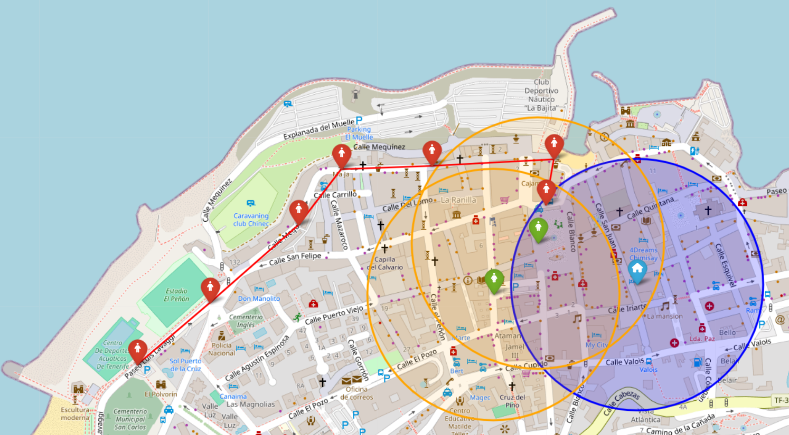

# GeoTrace Analyzer

GeoTrace Analyzer es una herramienta avanzada para visualizar y analizar datos geográficos. Está diseñada para rastrear ubicaciones, calcular distancias y determinar la proximidad entre entidades como víctimas, agresores y zonas seguras.

## Características principales

-   Representación de coordenadas geográficas en un mapa interactivo.
-   Cálculo de distancias entre diferentes puntos.
-   Detección de proximidad a zonas seguras.
-   Generación de mapas HTML fáciles de compartir.

## Requisitos previos

-   Python 3.8 o superior.
-   Librerías especificadas en `requirements.txt`.
-   Archivo `.env` con las configuraciones necesarias.

## Instalación

1.  Clona este repositorio:

    ```bash
    git clone https://github.com/tu-usuario/geotrace-analyzer.git
    cd geotrace-analyzer
    ```

2.  Crea un entorno virtual y actívalo:

    ```bash
    python -m venv venv
    source venv/bin/activate  # En Windows: venv\Scripts\activate
    ```

3.  Instala las dependencias:

    ```bash
    pip install -r requirements.txt
    ```

4.  Configura el archivo `.env` en el directorio principal:

    ```env
    PROXIMITY_DISTANCE=200 # Distancia en metros
    VALID_PRECISION=100

    ```

5. Configura el `secured_areas.json` en el directorio principal:
    ```json
    [
        {
            "name": "Domicilio",
            "coordinates": [28.415868, -16.54943],
            "type": "home"
        },
        {
            "name": "Centro de Trabajo",
            "coordinates": [28.41945820893739, -16.542202123565886],
            "type": "briefcase"
        },
        {
            "name": "Centro de Estudios",
            "coordinates": [28.41211, -16.550324],
            "type": "school"
        }
    ]
    ```
   
## Estructura del proyecto

```plaintext
GeoTrace Analyzer/
│
├── classes/               # Archivos CSV con datos de entrada
│   ├── Map.py             # Contiene los métodos para manejar el mapa
│   ├── Filesystem.py      # Gestión de archivos
├── data/                  # Archivos CSV con datos de entrada
├── result/                # Salida de mapas generados
├── utils/                 # Módulos auxiliares
│   ├── distance.py        # Cálculos de distancia
├── .env                   # Configuración de variables de entorno
├── secured_areas.json     # Configuración de zonas seguras
├── requirements.txt       # Dependencias del proyecto
├── main.py                # Script principal
└── README.md              # Documentación del proyecto
```

## Uso

1. Añade tus datos en formato CSV a la carpeta `data/`.

    - `A.csv` para datos del agresor.
    - `V.csv` para datos de la víctima.

2. Ejecuta el script principal:

    ```bash
    python main.py
    ```

3. El mapa generado se guardará en la carpeta `result/` como `map_points.html`.

## Ejemplo de entrada

### Formato requerido para los ficheros CSV:

Los archivos deben tener las siguientes columnas: `time`, `precision`, y `location` (coordenadas en formato "latitud,longitud").

#### Archivo `A.csv` (Agresores):

```csv
"time","precision","location"
"2024-12-20 22:05:20",4.5,"28.416768,-16.553500"
"2024-12-20 22:14:57",0.0,"28.417200,-16.553600"
"2024-12-20 22:14:59",4.5,"28.417800,-16.554000"
"2024-12-20 22:22:59",4.5,"28.418400,-16.554400"
"2024-12-20 22:26:44",4.5,"28.418900,-16.554800"
"2024-12-20 22:37:45",11.8,"28.419500,-16.555200"
"2024-12-20 22:37:46",11.8,"28.420000,-16.555600"
```

#### Archivo `V.csv` (Víctimas):

```csv
"time","precision","location"
"2024-12-20 22:10:20",3.0,"28.415500,-16.552900"
"2024-12-20 22:15:50",4.2,"28.416000,-16.553300"
"2024-12-20 22:20:30",5.0,"28.416500,-16.553700"
```

## Personalización

-   Cambia las coordenadas de la zona segura en el archivo `.env`.
-   Modifica el radio de proximidad (`PROXIMITY_DISTANCE`) según tus necesidades.

## Ejemplo visual



## Contribuciones

¡Las contribuciones son bienvenidas! Si encuentras errores o tienes sugerencias, abre un issue o envía un pull request.

## Licencia

Este proyecto está licenciado bajo la Licencia GNU GENERAL PUBLIC LICENSE. Consulta el archivo `LICENSE` para más detalles.
